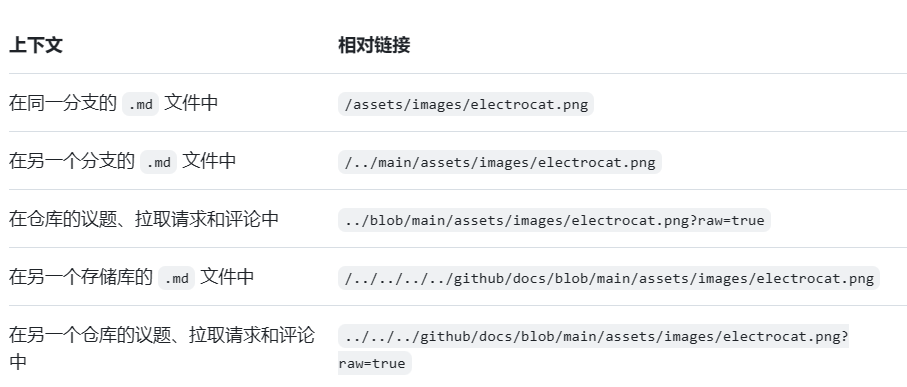

# 生信笔记记录帖  

## md格式用法记录  

1. 常用功能
- 在标题文本前添加一至六个 # 符号
```
  # A first-level heading
  ## A second-level heading
  ### A third-level heading
```
- 加粗
** ** 快捷键Ctrl+B (Windows/Linux)  
```
**This is bold text**
```
**This is bold text**	这是粗体文本

- 可以使用 > 来引用文本。

Text that is not a quote

> Text that is a quote

2.扩展功能

  1. 代码块之前和之后的行上使用三个反引号（```）。
    
    ```
    {
      "firstName": "John",
      "lastName": "Smith",
      "age": 25
    }
    ```
  2. 图片
     通过添加 ! 并 将 alt 文本用 [ ] 括起来，可显示图像。
     

